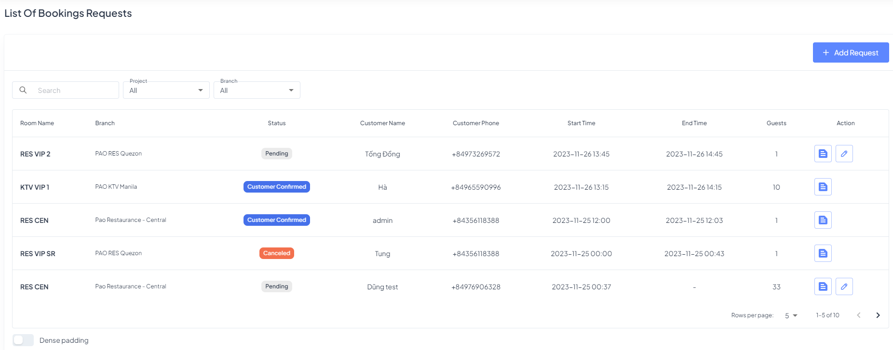

# 6. Booking

## 6.1 Booking Request

The Booking Request module tracks requests originating from the website for end-users or the CMS. The main interface displays a table listing all booking requests.

> _To access the Booking Request Management page, click on "**Booking**" in the navigation menu and then select "**Booking Request**_".

**Actions:**

* **Add**: Add new booking request
* **Edit:** Modify details of a booking request.
* **View Detail:** Access comprehensive information about a specific booking request.

Upon receiving a booking request, customer service has the option to confirm details with the customer, relying on the contract information provided in the request.

<figure><figcaption></figcaption></figure>

**Calling Customers for Confirmation**

* Customer service personnel can initiate a call to the customer to confirm booking details based on the contract information specified in the request.
* Confirmation calls ensure accuracy and enhance the overall booking experience.

After a booking request is set, confirmed or cancelled, the system sends a notification to the customer.

*   Booking is set:&#x20;

    ```
    Hi [Customer Name]! Your Pao KTV booking for [Room Name] on [Date] at [Time] is set! Pao KTV +63 9851 799 799
    ```
*   Booking confirmed:&#x20;

    ```
    Hi [Customer Name]! Your Pao KTV booking for [Room Name] on [Date] at [Time] is confirmed! Pao KTV +63 9851 799 799
    ```
*   Booking canceled:

    ```
    Hi [Customer Name]! Your Pao KTV booking for [Room Name] on [Date] at [Time] has been canceled! Pao KTV +63 9851 799 799
    ```
